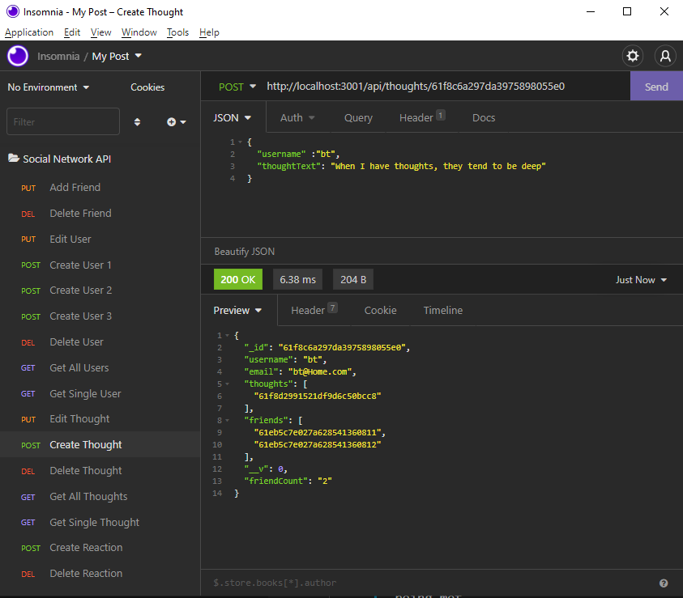

# Social-Network-API

## Task

MongoDB is a popular choice for many social networks due to its speed with large amounts of data and flexibility with unstructured data. The foundation of these applications is data, so it is important to understand how to build and structure the API.

This application is an API for a social network web application where users can share their thoughts, react to friends’ thoughts, and create a friend list. This application uses Express.js for routing, a MongoDB database, and the Mongoose Object Data Modeling (ODM). In addition to using the [Express.js](https://www.npmjs.com/package/express) and [Mongoose](https://www.npmjs.com/package/mongoose) packages, this application uses [Moment.js](https://www.npmjs.com/package/moment) to format dates.

No seed data is provided, so you’ll need to create your own data using an application like [Insomnia](https://insomnia.rest/download).

### Insomnia Screenshot

`Example of the 'Create Thought' POST route:`



Since this application is not deployed, this [walk-through video]() demonstrates its functionality and all of the following acceptance criteria being met.

## User Story

```md
AS A social media startup

I WANT an API for my social network that uses a NoSQL database
SO THAT my website can handle large amounts of unstructured data
```

## Satisfied Acceptance Criteria

```md
GIVEN a social network API

WHEN I enter the command to invoke the application
THEN my server is started and the Mongoose models are synced to the MongoDB database

WHEN I open API GET routes in Insomnia for users and thoughts
THEN the data for each of these routes is displayed in a formatted JSON

WHEN I test API POST, PUT, and DELETE routes in Insomnia
THEN I am able to successfully create, update, and delete users and thoughts in my database

WHEN I test API POST and DELETE routes in Insomnia
THEN I am able to successfully create and delete reactions to thoughts and add and remove friends to a user’s friend list
```

## Getting Started

Be sure to have MongoDB installed on your machine. Follow the [MongoDB installation guide on The Full-Stack Blog](https://coding-boot-camp.github.io/full-stack/mongodb/how-to-install-mongodb) to install MongoDB locally.

Models and API routes:

### Models

**User**:

- `username`

  - String
  - Unique
  - Required
  - Trimmed

- `email`

  - String
  - Required
  - Unique
  - Validation: Must match a valid email address

- `thoughts`

  - Array of `_id` values referencing the `Thought` model

- `friends`
  - Array of `_id` values referencing the `User` model (self-reference)

**Schema Settings**:

Virtual called `friendCount` retrieves the length of the user's `friends` array field on query.

---

**Thought**:

- `thoughtText`

  - String
  - Required
  - Must be between 1 and 280 characters

- `createdAt`

  - Date
  - Sets default value to the current timestamp
  - Getter method formats the timestamp on query with [Moment.js](https://www.npmjs.com/package/moment)

- `username` (The user that created this thought)

  - String
  - Required

- `reactions` (These are like replies)
  - Array of nested documents created with the `reactionSchema`

**Schema Settings**:

Virtual called `reactionCount` retrieves the length of the thought's `reactions` array field on query.

---

**Reaction** (SCHEMA ONLY)

- `reactionId`

  - Mongoose's ObjectId data type
  - Default value is set to a new ObjectId

- `reactionBody`

  - String
  - Required
  - 280 character maximum

- `username`

  - String
  - Required

- `createdAt`
  - Date
  - Sets default value to the current timestamp
  - Use a getter method to format the timestamp on query

**Schema Settings**:

This will not be a model, but rather will be used as the `reaction` field's subdocument schema in the `Thought` model.

### API Routes

**`/api/users`**

- `GET` all users

- `GET` a single user by its `_id` and populated thought and friend data

- `POST` a new user:

```json
// example data
{
  "username": "bravotango",
  "email": "bravotango@gmail.com"
}
```

- `PUT` to update a user by its `_id`

- `DELETE` to remove user by its `_id`

**BONUS INCLUDED**: Removes a user's associated thoughts when deleted.

---

**`/api/users/:userId/:friendId`**

- `POST` to add a new friend to a user's friend list

- `DELETE` to remove a friend from a user's friend list

---

**`/api/thoughts/:userId`**

- `GET` to get all thoughts

- `GET` to get a single thought by its `_id`

- `POST` to create a new thought (don't forget to push the created thought's `_id` to the associated user's `thoughts` array field)

```json
// example data
{
  "username": "bravotango",
  "thoughtText": "When I have thoughts, they tend to be deep"
}
```

- `PUT` to update a thought by its `_id`

- `DELETE` to remove a thought by its `_id`

---

**`/api/reactions/:thoughtId`**

- `POST` to create a reaction stored in a single thought's `reactions` array field

```json
// example data
{
  "reactionBody": "I like ur ideas",
  "username": "bt"
}
```

**`/api/reactions/:reactionId`**

- `DELETE` to pull and remove a reaction by the reaction's `reactionId` value

## Grading Requirements

This homework is graded based on the following criteria:

### Deliverables: 10%

- Your GitHub repository containing your application code.

### Walkthrough Video: 37%

- A walkthrough video that demonstrates the functionality of the social media API must be submitted, and a link to the video should be included in your README file.

  - The walkthrough video must show all of the technical acceptance criteria being met.

  - The walkthrough video must demonstrate how to start the application’s server.

  - The walkthrough video must demonstrate GET routes for all users and all thoughts being tested in Insomnia.

  - The walkthrough video must demonstrate GET routes for a single user and a single thought being tested in Insomnia.

  - The walkthrough video must demonstrate POST, PUT, and DELETE routes for users and thoughts being tested in Insomnia.

  - Walkthrough video must demonstrate POST and DELETE routes for a user’s friend list being tested in Insomnia.

  - Walkthrough video must demonstrate POST and DELETE routes for reactions to thoughts being tested in Insomnia.

### Technical Acceptance Criteria: 40%

- Satisfies all of the preceding acceptance criteria plus the following:

  - Uses the [Mongoose package](https://www.npmjs.com/package/mongoose) to connect to a MongoDB database.

  - Includes User and Thought models outlined in the homework instructions.

  - Includes schema settings for User and Thought models as outlined in the homework instructions.

  - Includes Reactions as the `reaction` field's subdocument schema in the Thought model.

  - Uses functionality to format queried timestamps properly.

### Repository Quality: 13%

- Repository has a unique name.

- Repository follows best practices for file structure and naming conventions.

- Repository follows best practices for class/id naming conventions, indentation, quality comments, etc.

- Repository contains multiple descriptive commit messages.

- Repository contains a high-quality README with description and a link to a walkthrough video.

### Bonus

- This application deletes a user's associated thoughts when the user is deleted.

## Review

You are required to submit BOTH of the following for review:

- A walkthrough video demonstrating the functionality of the application and all of the acceptance criteria being met.

- The URL of the GitHub repository. Give the repository a unique name and include a README describing the project.
